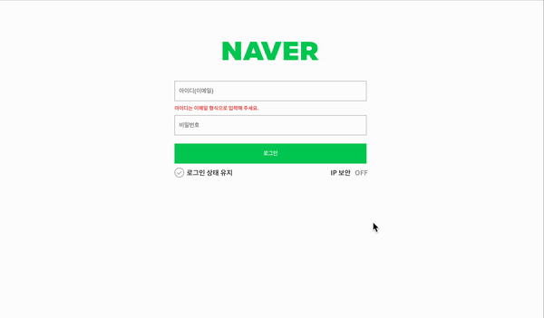

## 네이버 로그인 페이지 구현

---

### 목표

로그인과 비밀번호를 정확히 입력했을 때 welcome 페이지로 넘어갈 수 있도록 코드 로직을 작성합니다.

---

### 요구사항

1. email 정규표현식을 사용한 validation
2. pw 정규표현식을 사용한 validation
3. 로그인 버튼을 클릭시 user.id의 값과 input의 값을 비교
4. 로그인 버튼을 클릭시 user.pw의 값과 input의 값을 비교
5. 두 값이 일치 한다면 다음 페이지(welcome.html)로 이동

---

### validation

###### <email 코드를 예시로 설명>

1. 먼저 로그인 input 태그에 querySelector를 사용하여 접근
2. 변수로 지정해서 코드 재활용성을 높임

```
const email = document.querySelector(".user-email-input");
```

3. handleEamil 함수를 사용하고 preventDefault로 html 고유 동작 중지
4. if 조건문으로 정규표현식에 input의 내용을 포함하면 validation 제거</br>(is--invalid 클래스 추가 및 제거로 작동)

```
function handleEmail(e) {
  e.preventDefault();
  if (emailReg(email.value)) {
    email.classList.remove("is--invalid");
  } else {
    email.classList.add("is--invalid");
  }
}
```

5. addEventListener로 handleEamil 함수 실행

```
email.addEventListener("input", handleEmail);
```

---

### input 값과 user값 비교

#### 두 값이 일치할 경우 홈페이지 이동

1. querySelecto로 로그인 버튼에 접근
2. 변수 지정으로 코드 재활용성 높임

```
const button = document.querySelector(".btn-login");
```

3. handleButton 함수를 이용 및 preventDefault로 html 고유 동작 중지
4. 조건문으로 user.id 와 user.pw 값이 input 내용과 일치할 경우 'welcome.html' 페이지로 이동

```
function handleButton(e) {
  e.preventDefault();
  if (user.id === email.value && user.pw === password.value) {
    window.location.href = "welcome.html";
  }
}
```

5. addEventListener로 handleButton 함수 실행

```
button.addEventListener("click", handleButton);
```

---

### 결과

<p align="center"></p>

---

### 과제를 통해 느낀점

- 주어진 식을 최대한 활용하여 구현하는데 목적을 두었습니다.
- 코드 짜는게 익숙해진 후 더 높은 코드 재사용성에 대해 생각해보고 싶습니다.
- 아직까지 함수를 짜는데 익숙하지 않아 추가적인 연습이 많이 필요하다고 느꼈습니다.
